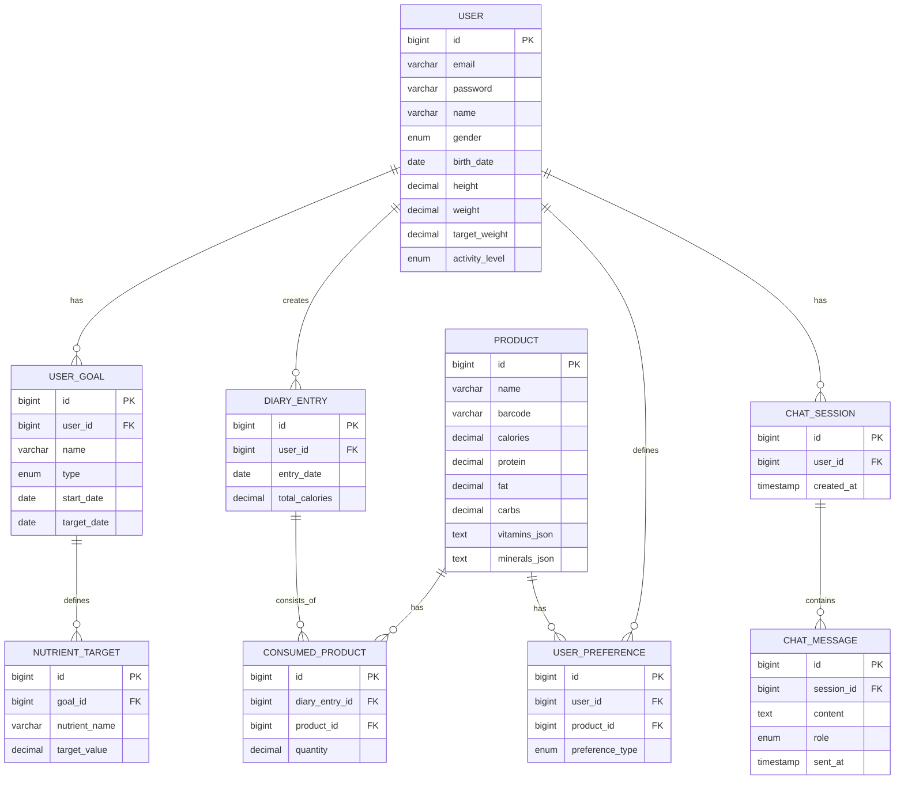

### **1. Актуальность и проблема**

В современном мире, с ростом интереса к здоровому образу жизни, осознанному питанию и спорту, все больше людей сталкиваются с необходимостью контроля своего рациона. Однако существующие приложения часто ограничиваются подсчетом калорий и БЖУ (белков, жиров, углеводов), игнорируя такие важные аспекты, как баланс витаминов и микроэлементов. Пользователю сложно самостоятельно составить сбалансированный рацион, учитывающий его индивидуальные нормы и пищевые предпочтения/ограничения.

**Проблема:** Отсутствие удобных и доступных инструментов, которые не только ведут учет потребляемой пищи, но и предоставляют интеллектуальные рекомендации по ее оптимизации с учетом комплексных потребностей в питательных веществах.

### **2. Цель и задачи работы**

**Цель работы:** Разработать кроссплатформенную приложение, которое предоставляет персонализированные рекомендации по продуктам для достижения пользователем заданных целей таких снижение веса, увеличение мышечной массы или рекомпозиции.

**Задачи для достижения цели:**

1.  Провести анализ предметной области и существующих аналогов.
2.  Разработать архитектуру системы, включая backend, web-интерфейс и мобильное приложение.
3.  Реализовать backend-часть на Kotlin с использованием Spring Boot и Thymeleaf.
4.  Разработать алгоритмы для двух основных сценариев рекомендаций:
    *   Рекомендация отдельных продуктов для поддержания необходимого уровня нутриентов.
    *   Генерация сбалансированных наборов продуктов на день.
5.  Интегрировать функционал распознавания продуктов по штрихкоду.
6.  Реализовать AI-ассистента для ответов на вопросы пользователя в контексте питания.
7.  Реализовать механизмы учета пользовательских предпочтений (любимые продукты, стоп-лист).
8.  Провести тестирование системы и оценить ее работоспособность.

### **3. Обзор предметной области и аналоги**

Были проанализированы популярные приложения: MyFitnessPal, FatSecret, Yazio.

**Выявленные недостатки аналогов:**
*   Акцент на калориях и БЖУ, скудный анализ витаминов и минералов.
*   Рекомендации носят общий характер, не персонализированы под необходимый уровень конкретных витаминов и минералов.
*   Отсутствие функции генерации готовых вариантов рациона на день на основе комплексных норм.

**Преимущества предлагаемого решения:**
*   Глубокий учет микроэлементов и витаминов.
*   Уникальные алгоритмы рекомендаций, основанные на приоритете выполнения нормы для необходимого уровня витаминов и минералов.
*   Высокая степень персонализации за счет учета стоп-листа и любимых продуктов.

### **4. Технологический стек**

*   **Backend:** Kotlin, Spring Boot (Web, Security, Data JPA), Apache Kafka
*   **База данных:** PostgreSQL
*   **Web-интерфейс:** Thymeleaf, HTML/CSS/JS, Bootstrap
*   **Мобильное приложение (Android):** *Рассматривается как опциональное. На текущем этапе основное внимание уделяется backend и web-интерфейсу. Реализация на Android является логическим продолжением проекта.*
*   **Внешние API:** Сервисы для получения данных о продуктах по штрихкоду (например, Open Food Facts)
*   **AI-ассистент:** Интеграция с LLM (Large Language Model), например, через OpenAI API или локально развернутую модель, для создания чат-бота по вопросам питания.

### **5. Основная функциональность системы (Главные особенности)**

1.  **Умный дневник питания:**
    *   Внесение приемов пищи с подсчетом КБЖУ, витаминов и микроэлементов.
    *   Отслеживание веса и потребления жидкости.
    *   Визуализация прогресса относительно заданных норм.

2.  **Система рекомендаций:**
    *   **Сценарий 1:** Пользователь вводит норму по калориям и/или конкретному микроэлементу (например, "железо 18 мг"). Система рекомендует 7 продуктов, наиболее эффективных для поддержания необходимого уровня микроэлементов, отсортированных по приоритету "мг микроэлемента / ккал".
    *   **Сценарий 2:** Пользователь задает полную дневную норму нутриентов (КБЖУ + витамины + минералы). Система генерирует 7 вариантов наборов продуктов на день, которые максимально близко соответствуют этой норме.

3.  **Персонализация:**
    *   Возможность создать список "любимых продуктов" для их приоритета в рекомендациях.
    *   Создание "стоп-листа" (аллергены, непереносимости, нелюбимые продукты) для их полного исключения из рекомендаций.
    *   Возможность ручной замены любого продукта в сгенерированном наборе на альтернативный из той же категории.

4.  **Удобство ввода данных:**
    *   **Распознавание по штрихкоду:** Быстрое добавление продукта в дневник путем сканирования его штрихкода. Система автоматически заполнит его nutritional-данные из базы.

5.  **AI-ассистент:**
    *   Встроенный чат, где пользователь может задавать вопросы на тему питания ("Дай идеи для ужина с высоким содержанием белка", "Объясни, что такое гликемический индекс").
  
### **6. Архитектура и проектирование системы**

#### **6.1. ER-диаграмма (Упрощенная модель данных)**



**Пояснение:**
*   **USER:** Основная сущность, хранящая демографические и антропометрические данные для расчета норм.
*   **USER_GOAL и NUTRIENT_TARGET:** Позволяют гибко настраивать цели не только по КБЖУ, но и по конкретным витаминам и минералам.
*   **PRODUCT:** Основной каталог продуктов с расширенной nutritional-информацией. Поля `vitamins_json` и `minerals_json` хранят данные о витаминах и минералах в структурированном виде (например, JSON).
*   **DIARY_ENTRY и CONSUMED_PRODUCT:** Отвечают за дневник питания.
*   **USER_PREFERENCE:** Универсальная сущность для хранения как "любимых продуктов" (`preference_type = FAVORITE`), так и продуктов из "стоп-листа" (`preference_type = BANNED`).
*   **CHAT_SESSION и CHAT_MESSAGE:** Обеспечивают функционал AI-ассистента, сохраняя историю диалогов.

#### **6.2. Прототип дизайна (Ключевые экраны)**

**1. Дашборд / Главная страница**
```
[ Логотип ]  Профиль [v]
-------------------------------------------------
| Добро пожаловать, [Имя]!                     |
| Ваша дневная норма: 2000 ккал                |
|-----------------------------------------------|
| | Потреблено: 1450 ккал  [============..] 73% | |
| | Белки:      [=====.....] 45% (72/150г)    | |
| | Железо:     [==.......] 18% (3.2/18мг)   | |
| | Витамин D:  [=........] 10% (1/10мкг)    | |
|                                               |
| [Добавить прием пищи] [Получить рекомендации] |
-------------------------------------------------
```
*   **Цель:** Быстрый обзор прогресса за день.
*   **Элементы:** Визуальные прогресс-бары по ключевым макро- и микроэлементам, отмеченным для отслеживания поддержания нормы. Кнопки для основных действий.

**2. Экран рекомендаций (Сценарий 1: Выполнение нормы по макро- и микроэлементам)**
```
Рекомендации для вас > Выполненить норму
-------------------------------------------------
Цель: Выполненить норму по [Железо ▼] (осталось 14.8 мг)
Приоритет: Эффективность (нутриент на калорию) [v]

Сортировка: По эффективности [v]  По алфавиту

1. [Иконка] Печень говяжья (100г)
   -> 17.9 мг железа | 127 ккал | Эффективность: 0.14 мг/ккал
   [Добавить в дневник] [В любимые]

2. [Иконка] Чечевица отварная (100г)
   -> 3.3 мг железа | 116 ккал | Эффективность: 0.028 мг/ккал
   [Добавить в дневник] [В любимые]

... (и так 7 продуктов)
```
*   **Цель:** Наглядно показать пользователю самые эффективные продукты для выполнения нормы по конкретному нутриенту.

**3. Экран рекомендаций (Сценарий 2: Набор на день)**
```
Рекомендации для вас > Готовый рацион на день
-------------------------------------------------
На основе вашей нормы: 2000 ккал, 150г белка, 18мг железа...
Учитывать: [v] Любимые [v] Исключить стоп-лист

Вариант 1 из 7 (Сбалансированный):
Завтрак: Овсянка на молоке, банан, яйцо всмятку (450 ккал)
Обед: Гречка с куриной грудкой, салат из огурцов (650 ккал)
...
Итого: 1990 ккал, 152г белка, 17.5мг железа...
[Применить этот план] [Показать другой] [Заменить продукт...]

```
*   **Цель:** Предоставить пользователю готовое, сбалансированное решение на весь день.

### **7. Подробный план работ в формате таймлайна**

**Общая длительность проекта: 16 недель**

| **Фаза** | **Недели** | **Задача** | **Результат** | **Примечания** |
| :--- | :--- | :--- | :--- | :--- |
| **I. Подготовка и проектирование** | **1-3** | **1.1. Углубленный анализ предметной области.** | ТЗ, User Stories, анализ рисков. | Уточнение списка отслеживаемых витаминов/минералов. |
| | | **1.2. Проектирование архитектуры и БД.** | ER-диаграмма, UML-диаграммы (Use Case, Sequence). | Выбор внешнего API для штрихкодов (Open Food Facts). |
| | | **1.3. Создание прототипов UI/UX.** | Интерактивный прототип в Figma. | Фокус на usability мобильного и веб-интерфейса. |
| **II. Разработка Backend (Ядро)** | **4-9** | **2.1. Настройка проекта, базовые сущности и Security.** | Работающая регистрация, аутентификация. | Spring Boot, Spring Security, JPA. |
| | | **2.2. Реализация CRUD для пользователей, продуктов, дневника.** | API для управления основными данными. | |
| | | **2.3. Разработка алгоритма рекомендаций (Сценарий 1).** | API, возвращающее топ-N продуктов по эффективности. | Алгоритм: `(mg_of_nutrient / calories)` с фильтрами. |
| | | **2.4. Разработка алгоритма рекомендаций (Сценарий 2).** | API, генерирующее варианты рационов на день. | Использование алгоритмов оптимизации (e.g., жадные алгоритмы, генетические алгоритмы). |
| | | **2.5. Интеграция с API штрихкодов.** | Эндпоинт для поиска продукта по штрихкоду. | |
| **III. Разработка Frontend (Web)** | **7-12** | **3.1. Верстка основных страниц (Дашборд, Дневник).** | Статические страницы с Bootstrap. | Thymeleaf для серверного рендеринга. |
| | | **3.2. Интеграция Frontend с Backend API.** | Динамическое отображение данных на дашборде. | AJAX-запросы для обновления прогресса. |
| | | **3.3. Реализация UI для системы рекомендаций.** | Страницы с интерактивными рекомендациями. | |
| **IV. Интеграция AI и Доработка** | **13-14** | **4.1. Разработка AI-ассистента (чат).** | Рабочий чат-интерфейс, интегрированный с LLM. | Настройка промптов для контекста питания, борьба с галлюцинациями. |
| | | **4.2. Реализация персонализации (любимые/стоп-лист).** | Логика учета предпочтений в алгоритмах. | |
| | | **4.3. Улучшение алгоритмов, базовое наполнение БД.** | База с 50-100 базовыми продуктами. | |
| **V. Тестирование и Финальная подготовка** | **15-16** | **5.1. Комплексное тестирование (Unit, Integration, UI).** | Отчет о тестировании, исправление багов. | |
| | | **5.2. Нагрузочное тестирование ключевых сценариев.** | Проверка производительности алгоритмов. | |
| | | **5.3. Подготовка документации и презентации.** | Пояснительная записка, слайды для защиты. | |

### **8. Ожидаемые результаты**

По итогу работы будет разработано полнофункциональное web-приложение, включающее:
*   Backend-API на Spring Boot (Kotlin).
*   Базу данных с расширенной nutritional-информацией о продуктах.
*   Web-интерфейс для управления дневником и получения рекомендаций.
*   Реализованные core-алгоритмы рекомендаций.
*   Интеграцию с API для распознавания штрихкодов.
*   Прототип AI-ассистента.

### **9. План дальнейшей работы**

1.  Реализация плана разработки в соответствии с таймлайном.
2.  Сбор обратной связи от первых тестовых пользователей и итеративная доработка UI/UX.
3.  Углубленное тестирование и оптимизация алгоритмов рекомендаций на реальных данных.
4.  Расширение базы продуктов.
5.  *Опционально:* Начало разработки мобильного клиента для Android.
6.  Подготовка полного текста пояснительной записки и презентации для защиты.

**Заключение:** Предлагаемое решение направлено на заполнение рыночной ниши интеллектуальных помощников для питания, которые работают не только с калориями, но и с полным спектром питательных веществ. Использование современных технологий, таких как Kotlin, Spring Boot и AI, позволяет создать мощный, производительный и удобный для пользователя продукт.
